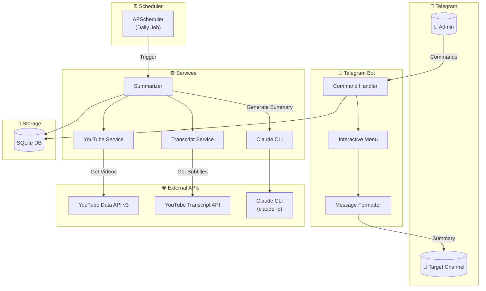
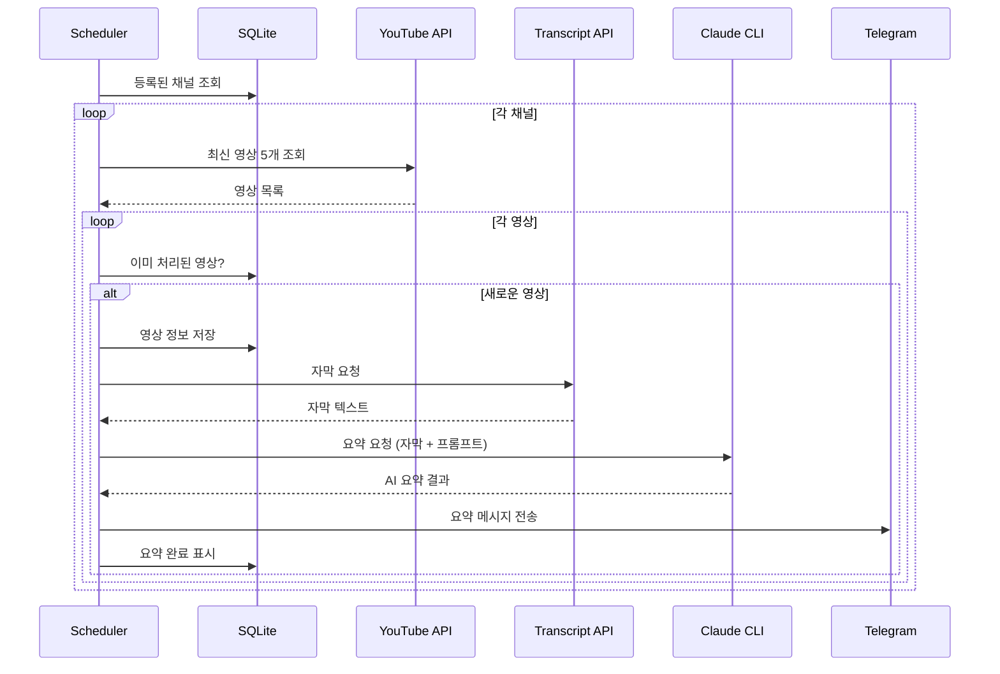

# 🎬 YouTube Summary Telegram Bot

YouTube 채널을 모니터링하고, 새 영상이 올라오면 자동으로 자막을 추출하여 Claude AI로 요약한 뒤 텔레그램으로 전송하는 봇입니다.

## 📋 주요 기능

- **채널 모니터링**: 등록된 YouTube 채널의 새 영상 자동 감지
- **AI 요약**: Claude CLI를 활용한 지능형 영상 요약
  - 30분 미만: 구조화된 요약 (핵심 주제, 주요 포인트, 인사이트)
  - 30분 이상: 구간별 상세 요약
- **텔레그램 봇**: 인터랙티브 버튼 메뉴로 편리한 조작
- **스케줄링**: 매일 지정된 시간에 자동 실행

## 🏗️ 아키텍처



## 📊 데이터 흐름



## 🗂️ 프로젝트 구조

```
youtube-summary-bot/
├── src/
│   ├── main.py              # 애플리케이션 진입점
│   ├── config.py            # 환경변수 및 설정
│   ├── bot/
│   │   ├── handlers.py      # 텔레그램 명령어 핸들러
│   │   ├── middleware.py    # 인증 미들웨어
│   │   └── formatters.py    # 메시지 포맷팅 (HTML)
│   ├── services/
│   │   ├── scheduler.py     # JobQueue 스케줄러
│   │   ├── youtube.py       # YouTube Data API 연동
│   │   ├── transcript.py    # 자막 추출
│   │   ├── summarizer.py    # 요약 오케스트레이션
│   │   └── claude_cli.py    # Claude CLI 호출
│   ├── db/
│   │   ├── database.py      # SQLite 연결 관리
│   │   ├── models.py        # 데이터 모델
│   │   └── repositories.py  # CRUD 작업
│   └── prompts/
│       ├── structured.txt   # 30분 미만 영상용
│       └── detailed.txt     # 30분 이상 영상용
├── data/
│   └── bot.db               # SQLite 데이터베이스
├── .env.example             # 환경변수 템플릿
├── requirements.txt         # Python 의존성
├── CLAUDE.md                # Claude Code 지시사항
└── README.md
```

## 🚀 설치 및 실행

### 1. 의존성 설치

```bash
pip install -r requirements.txt
```

### 2. 환경변수 설정

```bash
cp .env.example .env
```

`.env` 파일 편집:

```env
TELEGRAM_BOT_TOKEN=your_bot_token      # @BotFather에서 발급
ADMIN_CHAT_ID=123456789                 # 관리자 텔레그램 ID
TARGET_CHAT_ID=-1001234567890           # 요약 결과 전송 대상
YOUTUBE_API_KEY=your_api_key           # Google Cloud Console에서 발급
SCHEDULE_HOUR=10                        # 자동 실행 시간 (시)
SCHEDULE_MINUTE=0                       # 자동 실행 시간 (분)
```

### 3. 실행

```bash
python -m src.main
```

## 🔑 API 키 발급 방법

### Telegram Bot Token

1. 텔레그램에서 `@BotFather` 검색
2. `/newbot` 명령어로 봇 생성
3. 발급된 토큰을 `TELEGRAM_BOT_TOKEN`에 입력

### Chat ID 확인

1. 생성한 봇에게 메시지 전송
2. `https://api.telegram.org/bot<TOKEN>/getUpdates` 접속
3. `"chat":{"id":...}` 값 확인

### YouTube API Key

1. [Google Cloud Console](https://console.cloud.google.com) 접속
2. 프로젝트 생성
3. "YouTube Data API v3" 활성화
4. "사용자 인증 정보" → "API 키" 생성

## 📱 봇 사용법

### 인터랙티브 메뉴

`/start` 명령어로 버튼 메뉴 표시:

| 버튼 | 기능 |
|------|------|
| ➕ 채널 추가 | YouTube 채널 등록 |
| ➖ 채널 삭제 | 등록된 채널 삭제 |
| 📺 채널 목록 | 등록된 채널 조회 |
| 📝 영상 요약 | 특정 영상 즉시 요약 |
| ⏰ 시간 설정 | 스케줄 시간 변경 |
| 📊 상태 | 스케줄러 상태 확인 |
| ⏸ 일시정지 | 스케줄러 일시정지 |
| ▶️ 재개 | 스케줄러 재개 |
| 🚀 지금 실행 | 수동으로 즉시 실행 |

### 직접 명령어

```
/add_channel <URL>  - 채널 추가
/summarize <URL>    - 영상 요약
```

## ⚙️ 요약 방식

### 30분 미만 영상 (Structured)

```
## 핵심 주제
## 주요 포인트
## 인사이트
## 한 줄 요약
```

### 30분 이상 영상 (Detailed)

```
## 영상 개요
## 구간별 요약
  ### 도입부
  ### 본론 (섹션별)
  ### 마무리
## 핵심 포인트
## 한 줄 요약
```

## ⚠️ 주의사항

- **Claude CLI 필요**: `claude` 명령어가 PATH에 설치되어 있어야 함
- **YouTube API 할당량**: 일일 10,000 단위 제한
- **자막 필요**: 자막이 없는 영상은 요약 불가
- **텔레그램 제한**: 메시지당 4,096자 (자동 분할)

## 📄 라이선스

MIT License
